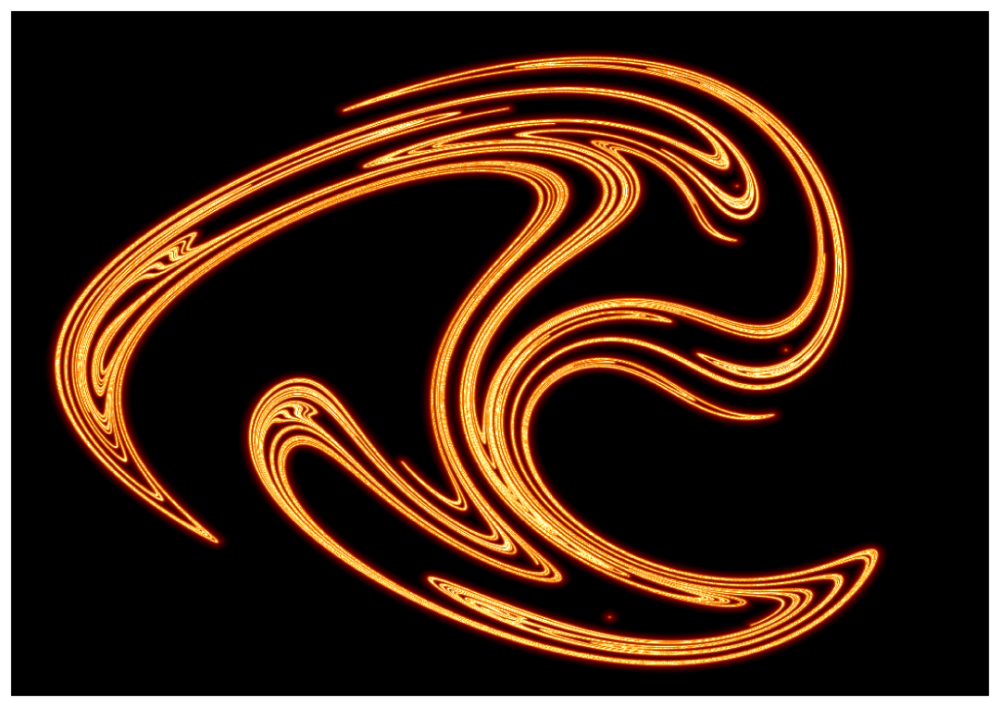
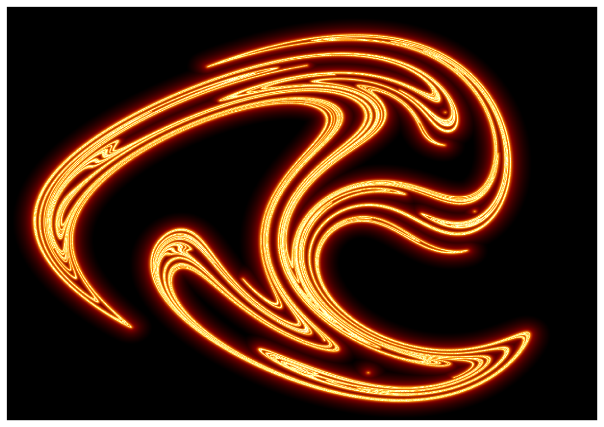

# Poster
This repo uses Julia's DynamicalSystems.jl to simulate a modified non linear duffing oscillator and create a phase portrait of the resulting motion. The oscillator is desvribed in more detail in this [paper](https://www.ijert.org/research/some-dynamical-properties-of-the-duffing-equation-IJERTV5IS120339.pdf). The resulting image is the distance to the nearest point in the phase portrait to a power specified by the user. Hence the heatmap is of
```math
distance^{power}.
```
The distance is found using a KDTree from NearestNeighbors.jl. 

## Examples

 


## Scripts
**functions.jl** Contains reuseable functions that allow quick prototyping of new plots with a variety of options. 
**modified_diffing_poincare** Creates a poincare plot of the oscillator. 